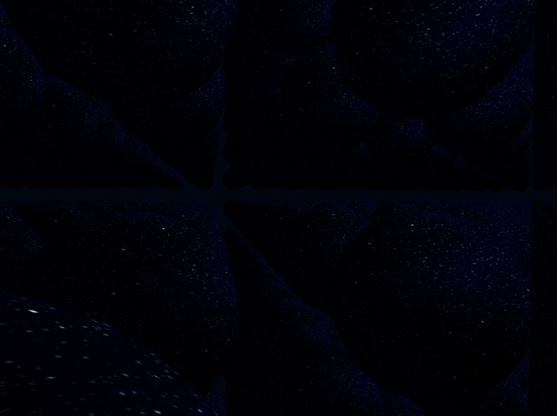

# Universe-Grid

---

> ### **This article needs rework!**
> ~~This article's *dong* needs to be **expanded**.~~
>
> Some of this article's *content* needs to be **expanded**.

> ### **This article about a concept seems to be a stub.**
> You can help this database by expanding it.

---

A **Universe-Grid**, sometimes referred to as a **_Universal Grid_**, is a **tesselation** of [**alernate universes**]() of a same **Realm**, so that they align in an orthonormal basis in all dimensions ($x,y,z,w...$).

&nbsp;

A representation of a Universal Grid seen in '#21:The World' by lsddev

&nbsp;

&nbsp;

### Contents

- [Universe-Grid Coordinates](#universe-grid-coordinates)

&nbsp;

&nbsp;

## Universe-Grid Coordinates

&nbsp;

**Universe-Grid Coordinates** are a set of numbers - or *"coordinates"* - used to determine the position of a specific [**universe**](../cncpt-unvrs.md).

These coordinates are identified using `3` (or more, if needed) **axes** and thus **variables** (ususally denoted $x$, $y$, and $z$ [...]).

For example, **Universe18**, `18`th universe of the **Bore-TR3**'s `13`th **TR3-Branch**, is located at the `(9;19;10)` Universe-Grid Coordinates:
$$
(9;19;10)\newline
x = 9\\
y = 19\\
z = 10
$$